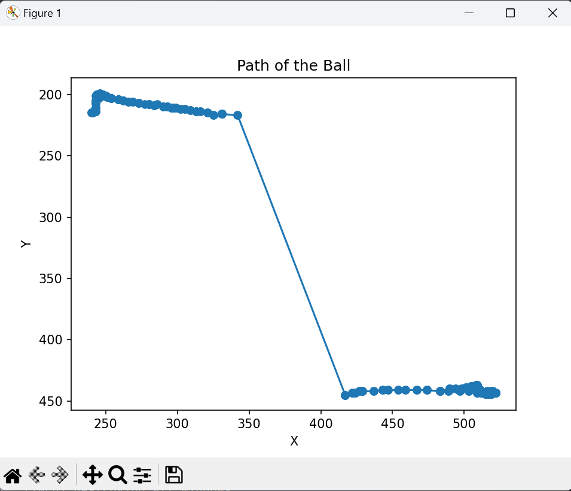

# Ball Tracking

Ce projet permet de suivre une balle en mouvement dans une vidéo en utilisant OpenCV et d'afficher le chemin suivi par la balle sur un graphique.

## Prérequis

Assurez-vous d'avoir les dépendances suivantes installées :

- Python 3.x
- OpenCV
- imutils
- numpy
- matplotlib

Vous pouvez installer les dépendances en utilisant `pip` :

```sh
pip install opencv-python imutils numpy matplotlib
```


## Utilisation

Pour exécuter le script, utilisez la commande suivante :
```sh 
python ball_tracking.py --video path_to_video_file --output path_to_output_file
```
- video : Chemin vers le fichier vidéo à analyser (optionnel, si non fourni, la webcam sera utilisée).
- output : Chemin vers le fichier vidéo de sortie où le suivi sera enregistré (optionnel).


## Exemple
Pour suivre une balle dans un fichier vidéo example.mp4 et enregistrer le résultat dans output.avi :
```sh 
python ball_tracking.py --video example.mp4 --output output.avi
```


## Description de code 
Le script fait ce qui suit :

- Lit un flux vidéo (webcam ou fichier vidéo).
- Redimensionne chaque frame, applique un flou et convertit en espace de couleurs HSV.
- Crée un masque pour détecter les contours de la balle.
- Utilise les contours pour déterminer la position de la balle et dessine le cercle autour de la balle.
- Met à jour une liste de points pour suivre le chemin de la balle.
- Affiche la vidéo avec le cercle et le chemin tracé.
- Enregistre la vidéo de sortie si spécifié.
- À la fin de la vidéo, trace le chemin de la balle en utilisant matplotlib.
## Contribution
Les contributions sont les bienvenues. Veuillez ouvrir une issue ou soumettre une pull request pour discuter de tout changement que vous souhaitez apporter.
## Licence 
Ce projet est sous licence MIT. Voir le fichier LICENSE pour plus de détails.
